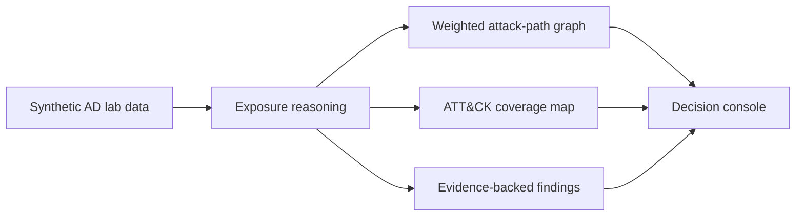

# RedPath

> **See the path. Prove the gap.**

[](https://github.com/Adam-Ghanem/RedPath/actions/workflows/validate.yml) [](LICENSE) [](#demo-mode) [](#safety-and-scope)

**RedPath** is an interactive, safe-by-design security product demo for understanding synthetic Active Directory exposure paths and validating whether defensive telemetry covers the behaviors that matter. It connects asset observations, weighted trust edges, MITRE ATT&CK techniques, finding evidence, and remediation guidance in one explainable console.

The repository starts in **demo mode** with fully synthetic data. No credentials, directory connection, agent, API key, or backend configuration is required to explore the attack-path graph, coverage dashboard, finding dossier, and four safe scenario playbooks.

## What the product demonstrates

| Surface | What visitors can inspect immediately |
| --- | --- |
| **Attack-path explorer** | A weighted synthetic Active Directory trust graph, selectable shortest paths, and highlighted chokepoints. |
| **Detection coverage** | Expected behaviors mapped to ATT&CK techniques, purple-team evidence, coverage by tactic, and clear gap verdicts. |
| **Findings explorer** | Every asset finding with severity, CVSS score, MITRE technique, supporting evidence, and a concrete remediation action. |
| **Safe scenario library** | Four individual evidence-led playbooks, each with expected techniques, an explicit dry-run recon plan, and an evidence-backed risk summary. |
| **Demo-first delivery** | A client-side seeded lab that remains useful even when no backend service is available. |

## Screenshots

### Landing overview


### Interactive attack-path console


See [the screenshot guide](docs/screenshots.md) for the verified views and data-handling note.

## Quick start

### Option A: Demo console only

The frontend is self-contained. It is the quickest way to explore the seeded lab.

```bash
git clone https://github.com/Adam-Ghanem/RedPath.git
cd RedPath/frontend
pnpm install
pnpm dev
```

Open [http://localhost:5173](http://localhost:5173). The console renders the synthetic lab immediately; it does not request a directory connection or execute commands.

### Option B: Full local stack

Docker Compose starts the existing backend alongside the frontend for users who want to inspect the API contracts as well.

```bash
git clone https://github.com/Adam-Ghanem/RedPath.git
cd RedPath
docker compose up --build
```

The frontend is available at [http://localhost:5173](http://localhost:5173), and the API documentation is available at [http://localhost:8000/docs](http://localhost:8000/docs).

## Interactive demo mode

The default dataset models six imaginary assets, five evidence-backed findings, three weighted paths, four ATT&CK tactic coverage summaries, and four scenario playbooks. The graph uses path cost to expose the lowest-cost relationship chain toward a privileged objective rather than asserting that the path has been executed.

| Synthetic scenario | Expected techniques | Coverage verdict |
| --- | --- | --- |
| Service identity exposure | `T1558.003`, `T1021.002` | Coverage gap |
| Pre-authentication drift | `T1558.004`, `T1098` | Partially covered |
| Certificate template escape | `T1649`, `T1098` | Coverage gap |
| File services blast radius | `T1021.002`, `T1098` | Validated |

The technique identifiers are linked to official ATT&CK entries and are presented as safe lab behaviors, not as instructions to compromise systems. [1] [2] [3] [4]

## Architecture



The frontend uses pre-seeded TypeScript data to make the demo immediately explorable. The repository also contains a FastAPI backend for safe lab workflows, audit-oriented domain services, and a Docker Compose configuration. The user-facing console does not depend on a backend for its default demo experience.

## Repository structure

```text
RedPath/
├── frontend/                 # Vite + React synthetic-data product console
│   └── src/data/             # Typed demo model and contract tests
├── backend/                  # FastAPI services for authorized lab workflows
├── docs/                     # Architecture, scenarios, validation, screenshot notes
├── screenshots/              # README product captures
├── CONTRIBUTING.md           # Safe contribution workflow
└── docker-compose.yml        # Optional full local stack
```

## Validation

The frontend test suite verifies that all paths are weighted and explorable, that the overall detection score is derived from tactic-level evidence, and that every scenario retains required safety and detail fields. Run the checks locally with:

```bash
cd frontend
pnpm test
pnpm run build
```

The repository includes a ready-to-enable [GitHub Actions validation template](docs/github-actions/validate.yml) for the frontend checks and backend suite. A maintainer can copy it into `.github/workflows/validate.yml` after enabling the GitHub App’s **Workflows** permission.

## Safety and scope

RedPath is a **defensive, lab-oriented project**. It must only be used against systems that you own or are explicitly authorized to assess. Demo mode uses fabricated hosts, identities, findings, paths, and evidence. It does not store credentials, connect to a directory, or execute network commands.

> The scenario plans are dry-run display artifacts for safe learning and defensive validation. They are not operational runbooks and should not be applied to production systems.

## Contributing

The project values precise documentation, explainable reasoning, deterministic test coverage, and safety-by-default product behavior. Please read [CONTRIBUTING.md](CONTRIBUTING.md) before opening an issue or pull request.

## References

[1]: https://attack.mitre.org/techniques/T1558/003/ "MITRE ATT&CK: Kerberoasting"
[2]: https://attack.mitre.org/techniques/T1558/004/ "MITRE ATT&CK: AS-REP Roasting"
[3]: https://attack.mitre.org/techniques/T1649/ "MITRE ATT&CK: Steal or Forge Authentication Certificates"
[4]: https://attack.mitre.org/techniques/T1021/002/ "MITRE ATT&CK: SMB/Windows Admin Shares"
