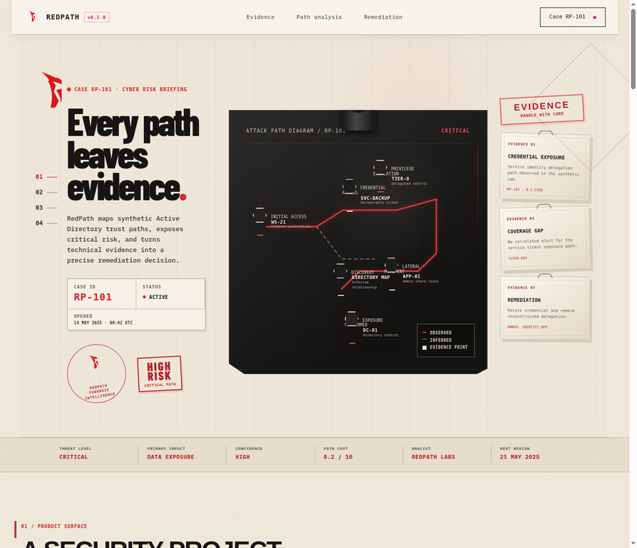
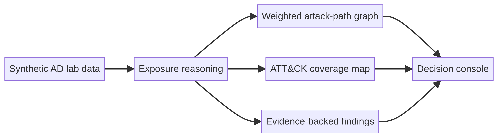
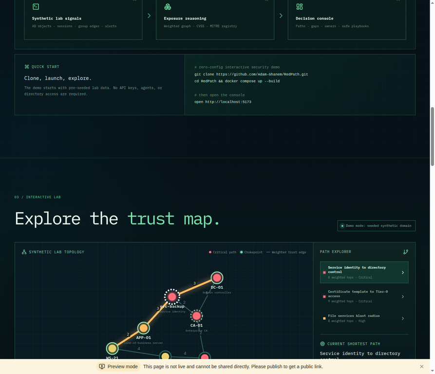

<p align="center">
  <a href="https://github.com/Adam-Ghanem/RedPath">
    
  </a>
</p>

<h1 align="center">RedPath</h1>

<p align="center"><strong>See the path. Prove the gap.</strong></p>

<p align="center">
  <a href="https://redpath-sec.vercel.app"><strong>Try the live demo →</strong></a>
</p>

<p align="center">
  <a href="https://redpath-sec.vercel.app"></a>
  <a href="frontend/DEPLOYMENT.md"></a>
  <a href="frontend/DEPLOYMENT.md"></a>
  <a href="backend/requirements.txt"></a>
  <a href="LICENSE"></a>
</p>

Most pentest tools list vulnerabilities. **RedPath answers the question a SOC team actually needs answered:** *if this attack path exists, do we have evidence that we would detect it?*

RedPath turns a synthetic Active Directory trust map into a visual case file: weighted exposure paths, ATT&CK-aligned detection coverage, evidence-backed findings, and practical remediation in one explainable console. It is safe to explore immediately—no directory, credentials, agent, API key, or clone required.

## TL;DR

- **Explore a complete attack-path case file in your browser:** [open the seeded live demo](https://redpath-sec.vercel.app).
- **Connect exposure to detection:** inspect weighted paths, chokepoints, ATT&CK coverage, evidence, and remediation together.
- **Built for safe evaluation:** every asset, path, finding, and scenario is fully synthetic and dry-run by design.

## See it in action



> **Product walkthrough:** A concise tour of the attack-path graph, detection-coverage view, and report workflow is planned for this section. Maintainers can follow the free recording guide in [`docs/record-demo.md`](docs/record-demo.md) to add `assets/demo/redpath-walkthrough.gif` (under 10 MB) from the live demo.

| In less than one minute | What the viewer sees |
| --- | --- |
| **Attack path graph** | A weighted, visual chain from a user-side asset to a privileged objective, with observed versus inferred relationships. |
| **Detection coverage** | ATT&CK-aligned coverage by tactic, purple-team gaps, and the evidence supporting each verdict. |
| **Case report workflow** | Evidence cards, remediation ownership, and a print-ready case-file layout that can be saved as a PDF from the browser. |

## Why this is different

| Generic vulnerability scanner | RedPath |
| --- | --- |
| Lists isolated weaknesses. | Connects weak signals into an explainable, weighted exposure path. |
| Reports a finding without showing defensive context. | Maps each path and finding to detection coverage and a clear gap verdict. |
| Usually requires an environment connection before it is useful. | Starts instantly with a safe, synthetic domain that is already explorable. |
| Treats remediation as a generic recommendation. | Keeps evidence, ATT&CK context, remediation owner, and review state in the same case file. |

## What you can inspect

| Surface | What it demonstrates |
| --- | --- |
| **Attack-path explorer** | Weighted synthetic Active Directory relationships, shortest paths, chokepoints, and observed versus inferred edges. |
| **Detection coverage** | Expected behaviors mapped to ATT&CK techniques, purple-team evidence, coverage by tactic, and gap verdicts. |
| **Findings dossier** | Asset-level severity, CVSS, technique mapping, supporting evidence, and a concrete remediation action. |
| **Safe scenario library** | Four individually detailed playbooks with expected techniques, dry-run recon plans, and evidence-backed risk summaries. |
| **Case-file report** | A structured, print-ready briefing surface that can be saved as a PDF from a browser without an external reporting service. |

## Quickstart

The live demo is the fastest route. To run the same seeded console locally, use three commands:

```bash
git clone https://github.com/Adam-Ghanem/RedPath.git && cd RedPath/frontend
pnpm install
pnpm dev
```

Open [http://localhost:5173](http://localhost:5173). The frontend renders the synthetic lab immediately and does not connect to a directory or execute commands.

## Demo mode and safety

The default dataset models six fictional assets, five evidence-backed findings, three weighted paths, ATT&CK tactic coverage, and four safe scenario playbooks. It is intentionally a **synthetic, dry-run learning and evaluation environment**.

| Synthetic scenario | Expected techniques | Coverage verdict |
| --- | --- | --- |
| Service identity exposure | `T1558.003`, `T1021.002` | Coverage gap |
| Pre-authentication drift | `T1558.004`, `T1098` | Partially covered |
| Certificate template escape | `T1649`, `T1098` | Coverage gap |
| File services blast radius | `T1021.002`, `T1098` | Validated |

> RedPath must only be used against systems you own or are explicitly authorized to assess. Demo mode contains fabricated hosts, identities, evidence, and paths; it does not store credentials, execute reconnaissance, or connect to an Active Directory environment.

## Architecture



The browser-first console uses pre-seeded TypeScript data to stay immediately explorable. The repository also includes a FastAPI backend for authorized lab workflows, audit-oriented services, and Docker Compose guidance; the live demo remains useful without those services.

## Screenshots

| Forensic dashboard | Interactive path console |
| --- | --- |
|  |  |

See [the screenshot guide](docs/screenshots.md) for verified views and data-handling notes.

## Optional full stack

The optional stack is for maintainers inspecting API contracts—not for using the demo.

```bash
docker compose --profile demo up --build
```

The console is available at [http://localhost:5173](http://localhost:5173); API documentation is available at [http://localhost:8000/docs](http://localhost:8000/docs). Read the [safe demo deployment guide](docs/demo-deployment.md) before deploying the profile to Render or Fly.io.

## Contributing

Contributions are welcome when they preserve RedPath’s safe, explainable, and reproducible design. Read [CONTRIBUTING.md](CONTRIBUTING.md) before opening an issue or pull request.

## Roadmap

- [ ] Add a concise, real browser walkthrough GIF for the live dashboard, coverage view, and PDF save flow.
- [ ] Add evidence-detail deep links from each graph node.
- [ ] Publish additional synthetic scenarios for identity, certificate, and lateral-movement coverage gaps.

## References

[1]: https://attack.mitre.org/techniques/T1558/003/ "MITRE ATT&CK: Kerberoasting"
[2]: https://attack.mitre.org/techniques/T1558/004/ "MITRE ATT&CK: AS-REP Roasting"
[3]: https://attack.mitre.org/techniques/T1649/ "MITRE ATT&CK: Steal or Forge Authentication Certificates"
[4]: https://attack.mitre.org/techniques/T1021/002/ "MITRE ATT&CK: SMB/Windows Admin Shares"
