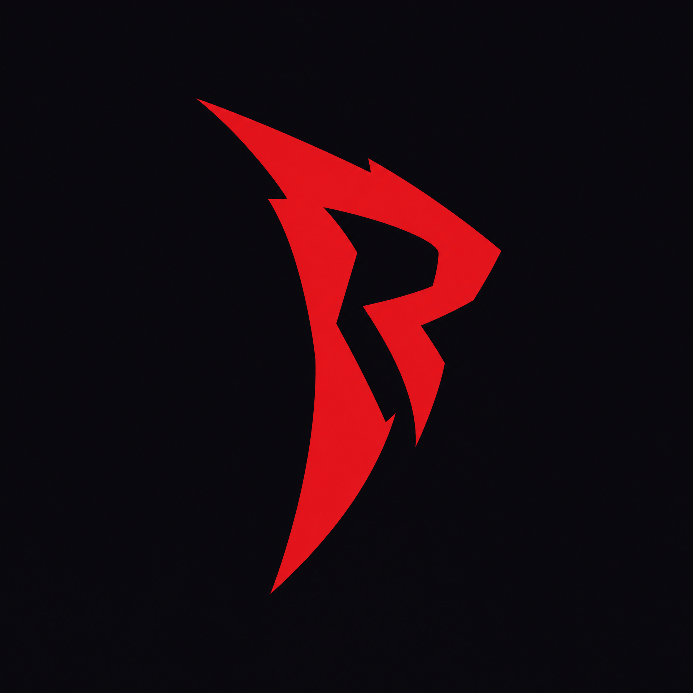
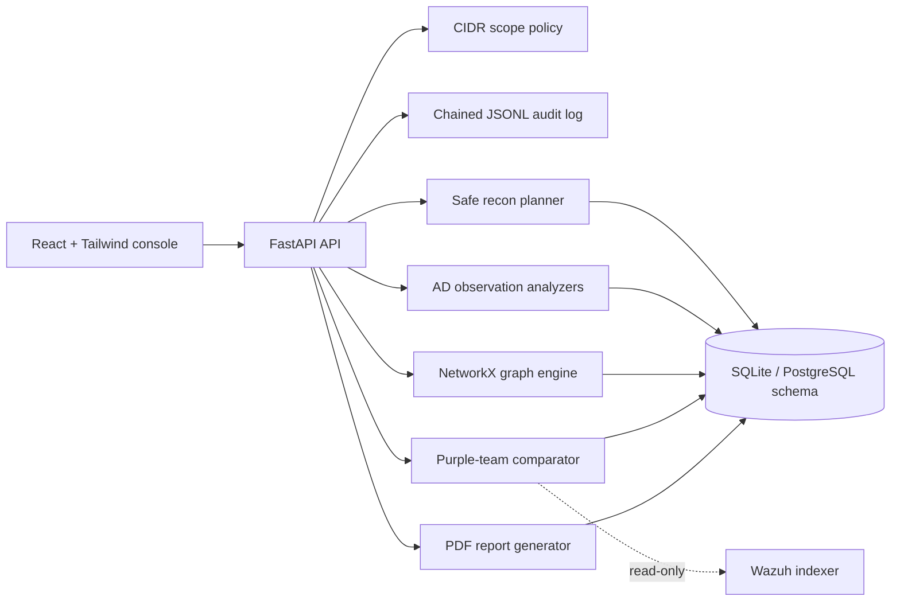

# RedPath

## Advanced Internal Pentest & Attack Path Simulator

RedPath is a **safe-by-design internal Active Directory lab assessment platform** that connects offensive discovery, attack-path reasoning, and defensive validation in one workflow. It is designed as a cybersecurity portfolio project for demonstrating Python/FastAPI engineering, React dashboard development, MITRE ATT&CK mapping, graph analytics, vulnerability correlation, and SOC detection-gap analysis.

> **Scope statement:** RedPath is for authorized, isolated lab environments only. It defaults to dry-run, enforces an IP/CIDR allow-list, avoids arbitrary shell text, does not store credentials, and analyzes supplied AD observations rather than implementing credential-theft or exploitation workflows.

## Why this project is credible

A conventional scanner can produce a list of services. RedPath asks a more useful question: **which observed weaknesses form a plausible path to a high-value privilege, which node is the chokepoint, and did the SIEM detect the technique?** The platform returns explainable evidence rather than a black-box risk number. Every finding includes an asset, a severity, optional CVSS score and vector, MITRE technique mapping, evidence, and remediation guidance.

The purple-team loop is intentionally repeatable. A lab run produces expected techniques, imported Wazuh-style evidence, coverage percentage, missing detections, and recommendations for rule tuning. The Wazuh integration is read-only, while report generation turns the same evidence into a PDF suitable for a review or interview demonstration.

## Architecture



The backend is organized around narrow, testable services. The recon module validates target scope and produces safe `argv` arrays for `nmap`, `enum4linux`, and `smbclient`. Dry-run returns those arrays without execution; non-dry-run remains unavailable while `DRY_RUN=true`. The AD analyzer consumes lab-exported observations, and the graph engine uses Dijkstra for weighted shortest paths plus betweenness centrality for chokepoints. The React console presents posture, assets, findings, graph paths, and detection coverage in a dark cyber interface.

## Capabilities delivered

| Capability | Implementation |
| --- | --- |
| Scoped recon | FastAPI endpoint, CIDR allow-list, `nmap` service inventory, optional SMB inventory, timeout controls |
| AD technique analysis | Observation-based checks for Kerberoasting, AS-REP Roasting, and authentication-certificate risk |
| MITRE ATT&CK | Registry for `T1558.003`, `T1558.004`, and `T1649`, including detection hints and remediation |
| Attack paths | NetworkX directed graph, Dijkstra shortest path, betweenness-centrality chokepoints |
| CVSS | Score and vector fields in finding contracts and database schema |
| Purple team | Imported Wazuh-style alert comparison and detection-gap recommendations |
| Scenario library | Four safe playbooks, persisted assessment history, evidence-backed risk, and dry-run execution |
| Expert operations | Campaigns, evidence provenance, remediation ownership, risk trends, and detection-tuning queue |
| Reporting | FPDF2 report with executive summary, findings, MITRE mappings, gaps, and remediation |
| Safety | Dry-run default, strict scope, no arbitrary shell, append-only chained audit log, no credential persistence |
| Delivery | Docker Compose, React/Vite frontend, Pytest/Ruff/Bandit/Semgrep CI configuration |

## Quickstart

The fastest portfolio demo uses Docker Compose. Copy `.env.example` to `.env`, keep `DRY_RUN=true`, and set only the private lab ranges you own.

```bash
cp .env.example .env
docker compose up --build
```

Open the dashboard at [http://localhost:5173](http://localhost:5173) and the interactive API documentation at [http://localhost:8000/docs](http://localhost:8000/docs). If the API is not running, the dashboard remains in demo mode with seeded graph and coverage data; the UI never executes a command by itself.

The dry-run recon contract can be exercised directly:

```bash
curl -s http://localhost:8000/api/v1/recon \
  -H 'Content-Type: application/json' \
  -d '{"targets":["192.168.56.10"],"profile":"service_inventory","dry_run":true}'
```

The AD observation analyzer can be demonstrated with synthetic lab data:

```bash
curl -s http://localhost:8000/api/v1/detections/ad \
  -H 'Content-Type: application/json' \
  -d '[
    {"asset_id":"DC-01","service_principal_name":"MSSQLSvc/db01.lab.local:1433"},
    {"asset_id":"USER-07","preauth_disabled":true},
    {"asset_id":"CA-01","enrollee_supplies_subject":true,"client_auth_eku":true}
  ]'
```

The graph endpoint accepts explicit nodes and edges and returns the weighted shortest path plus chokepoints. The purple endpoint accepts expected technique IDs and imported alerts, so a reviewer can show a coverage gap without running an attack.

## Repository structure

```text
RedPath/
├── backend/
│   ├── app/
│   │   ├── api/routes.py              # Versioned FastAPI endpoints
│   │   ├── core/                      # Settings, scope, chained audit log
│   │   ├── db/models.py               # SQLAlchemy schema
│   │   ├── schemas/contracts.py       # Typed API contracts
│   │   ├── services/
│   │   │   ├── recon.py               # Safe command planner/runner
│   │   │   ├── ad_detection.py        # Observation-based AD checks
│   │   │   ├── mitre.py               # ATT&CK registry
│   │   │   ├── graph_engine.py        # Dijkstra + centrality
│   │   │   ├── purple.py               # Wazuh-style coverage comparator
│   │   │   ├── wazuh.py                # Read-only indexer adapter
│   │   │   ├── report.py               # PDF export
│   │   │   ├── scenarios.py            # Curated safe playbooks
│   │   │   └── scenario_runner.py      # Evidence-to-run persistence
│   │   └── main.py                    # FastAPI application
│   ├── tests/test_core.py             # Core safety and analytics tests
│   ├── Dockerfile
│   └── requirements.txt
├── frontend/
│   ├── src/App.tsx                    # Dashboard shell
│   ├── src/components/AttackPathGraph.tsx
│   ├── src/components/ScenarioPanel.tsx # Scenario execution + run history
│   ├── src/data/mock.ts               # Safe demo dataset
│   ├── src/index.css                  # Dark cyber visual system
│   ├── Dockerfile
│   └── package.json
├── docs/
│   ├── architecture.md
│   ├── api.md
│   ├── database.md
│   ├── lab-setup.md
│   ├── roadmap.md
│   ├── scenarios.md
│   ├── v2-architecture.md
├── lab/fixtures/                    # Synthetic AD, Wazuh, and scenario evidence
├── docker-compose.yml
├── pyproject.toml
└── README.md
```

## Development checks

For the backend, install `backend/requirements.txt`, set `PYTHONPATH=backend`, and run the unit tests and static checks.

```bash
python3 -m venv .venv
. .venv/bin/activate
pip install -r backend/requirements.txt
PYTHONPATH=backend pytest
ruff check backend
bandit -r backend/app -ll
```

For the frontend, install dependencies and build the production bundle.

```bash
cd frontend
npm install
npm run lint
npm run build
```

The CI definition runs the same categories of checks and includes Semgrep as a policy gate. It is available at [ci/redpath-ci.yml](ci/redpath-ci.yml), while [docs/ci-setup.md](docs/ci-setup.md) explains how an authorized repository maintainer can activate it under `.github/workflows/`. In an interview, the important discussion is not only that the checks pass, but what they protect: shell-injection resistance, scope enforcement, dependency hygiene, typed contracts, and regression coverage for the analytics layer.

## Lab guide

Read [docs/lab-setup.md](docs/lab-setup.md) before connecting any lab system. It describes a host-only 2–3 VM Active Directory topology, synthetic identities, observation fixtures, Wazuh agent/indexer integration, read-only alert querying, and stop conditions. The official Wazuh documentation shows that alerts are indexed under `wazuh-alerts*` and can be queried through the indexer `_search` endpoint [3]. MITRE's official entries identify Kerberoasting as `T1558.003` and AS-REP Roasting as `T1558.004` [1] [2]. FIRST's CVSS v3.1 specification defines Base, Temporal, and Environmental metric groups and requires the vector to be presented with the score [4].

## Roadmap

The staged plan is in [docs/roadmap.md](docs/roadmap.md). The expanded scenario workflow is documented in [docs/scenarios.md](docs/scenarios.md), and the expert-level domain model is in [docs/v2-architecture.md](docs/v2-architecture.md). The clean onboarding evidence is recorded in [docs/validation.md](docs/validation.md), including dependency audit, 12-test backend validation, frontend production build, and Docker Compose service health.
MVP is the safe evidence-to-graph loop.
v1 adds a read-only Wazuh indexer workflow, report regression fixtures, and richer detection engineering. v2 adds the plugin SDK, graph snapshots, environmental risk modifiers, and signed run artifacts.

## References

[1]: https://attack.mitre.org/techniques/T1558/003/ "MITRE ATT&CK: Kerberoasting"
[2]: https://attack.mitre.org/techniques/T1558/004/ "MITRE ATT&CK: AS-REP Roasting"
[3]: https://documentation.wazuh.com/current/user-manual/indexer-api/use-case.html "Wazuh Indexer API use cases"
[4]: https://www.first.org/cvss/v3.1/specification-document "FIRST CVSS v3.1 specification"
