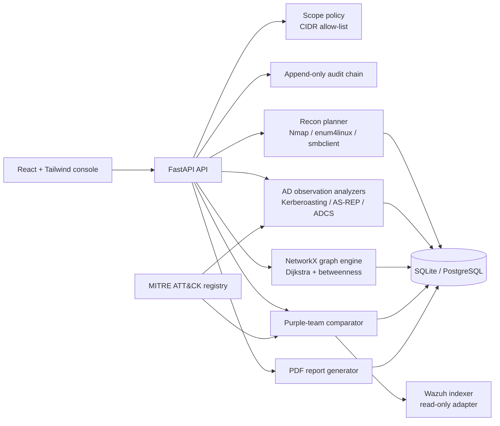

# RedPath architecture

RedPath is divided into a **control plane** and an **evidence plane**. The control plane validates scope, selects safe operations, records audit events, and exposes typed APIs. The evidence plane stores observations, findings, graph relationships, MITRE mappings, and detection coverage. The design keeps discovery and simulation separate from destructive actions: MVP functions analyze supplied observations and planned commands, while v1 adds read-only Wazuh evidence retrieval.

## Safety boundaries

The application refuses targets outside configured private lab ranges. Requests are validated with Python's `ipaddress` module before command construction. Dry-run is enabled by default in the environment, and the API uses the safer of the request and environment settings. When dry-run is active, RedPath returns the exact argument arrays it would use without executing them. The command runner uses `subprocess.run` with an argument list, a timeout, and an executable allow-list; it does not invoke a shell or accept arbitrary command text.

The AD checks are **observation analyzers**, not attack implementations. A user provides exported lab metadata or synthetic fixtures, and RedPath identifies risky conditions such as SPNs, disabled Kerberos pre-authentication, or certificate-template settings. Purple-team comparison consumes alert evidence and produces tuning recommendations; it does not deploy rules automatically.

## Plugin model

The intended v2 plugin contract is a narrow interface with three methods: a stable plugin identifier, a `plan()` method that returns safe actions and required permissions, and an `analyze()` method that accepts normalized observations and returns typed findings. Plugins must declare their MITRE technique IDs, scope requirements, and whether they support dry-run. The core orchestrator remains responsible for scope validation, audit logging, timeout policy, and persistence.

## Data flow

A run begins with a user-selected target or evidence set. RedPath validates scope, writes an audit event, executes or simulates the selected module, normalizes output into assets and findings, maps each finding to ATT&CK and CVSS metadata, and then builds graph edges from explicit relationships. The dashboard consumes the resulting JSON; the report generator renders the same evidence into a PDF so the UI and report remain consistent.

## References

[1]: https://attack.mitre.org/techniques/T1558/003/ "MITRE ATT&CK: Kerberoasting"
[2]: https://attack.mitre.org/techniques/T1558/004/ "MITRE ATT&CK: AS-REP Roasting"
[3]: https://documentation.wazuh.com/current/user-manual/indexer-api/use-case.html "Wazuh Indexer API use cases"
[4]: https://www.first.org/cvss/v3.1/specification-document "FIRST CVSS v3.1 specification"
